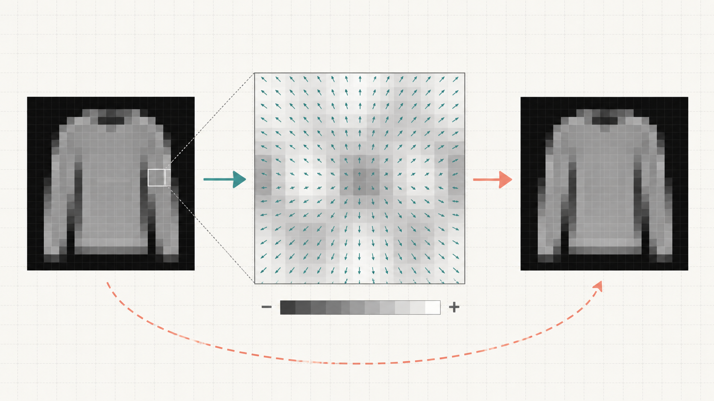
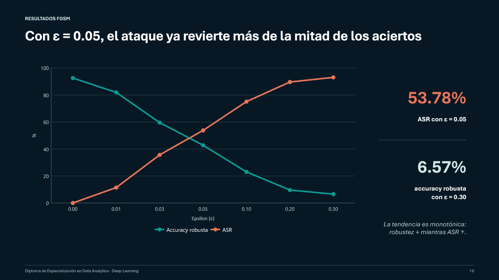

# Clasificación de Fashion-MNIST y robustez adversaria con FGSM

Proyecto final del Diplomado de Especialización en Data Analytics. Se entrena una red neuronal convolucional (CNN) para clasificar las diez categorías de **Fashion-MNIST** y posteriormente se evalúa la estabilidad de sus predicciones mediante el ataque adversario **Fast Gradient Sign Method (FGSM)**.

El resultado central del experimento es que una buena exactitud convencional no garantiza robustez: la CNN obtuvo **92.56% de accuracy limpia**, pero su accuracy robusta descendió a **6.57%** con `epsilon = 0.30`, mientras la tasa de éxito del ataque alcanzó **93.06%**.

> Los valores publicados corresponden a la ejecución documentada por el equipo. Aunque se utiliza semilla 42 y se habilita determinismo cuando el entorno lo permite, una nueva ejecución puede presentar pequeñas diferencias según la versión de TensorFlow, el hardware y el backend utilizado.

## Objetivos

- Clasificar imágenes de prendas mediante una CNN de complejidad moderada.
- Comparar la accuracy limpia con benchmarks públicos de Fashion-MNIST.
- Implementar FGSM usando el gradiente de la pérdida respecto de la entrada.
- Medir la **accuracy robusta** y la **Attack Success Rate (ASR)** para diferentes valores de epsilon.
- Evidenciar la diferencia entre desempeño limpio y estabilidad adversaria.

## Arquitectura del modelo

La CNN utiliza la siguiente secuencia:

```text
Entrada 28x28x1
  -> Conv2D(32, 3x3, ReLU) -> MaxPooling2D
  -> Conv2D(64, 3x3, ReLU) -> MaxPooling2D
  -> Dropout(0.25) -> Flatten
  -> Dense(128, ReLU) -> Dropout(0.50)
  -> Dense(10 logits)
```

La capa final no aplica Softmax. La pérdida se configura con `SparseCategoricalCrossentropy(from_logits=True)`, lo que mantiene coherencia entre la salida del modelo y el cálculo del gradiente utilizado por FGSM.

## ¿Qué hace FGSM?

FGSM genera una copia perturbada de cada imagen mediante:

```text
x_adv = clip(x + epsilon * sign(grad_x J(theta, x, y)), 0, 1)
```

- `x`: imagen limpia normalizada.
- `epsilon`: intensidad máxima de la perturbación por píxel.
- `grad_x J`: gradiente de la pérdida respecto de la imagen.
- `clip`: mantiene los valores de los píxeles dentro de `[0, 1]`.

Durante la evaluación adversaria los pesos del modelo permanecen fijos y el dataset original no se modifica.



## Resultados obtenidos

| Epsilon | Accuracy robusta | ASR |
|---:|---:|---:|
| 0.00 | 92.56% | 0.00% |
| 0.01 | 81.96% | 11.45% |
| 0.03 | 59.57% | 35.64% |
| 0.05 | 42.78% | 53.78% |
| 0.10 | 23.03% | 75.12% |
| 0.20 | 9.61% | 89.63% |
| 0.30 | 6.57% | 93.06% |

La **accuracy robusta** es el porcentaje de imágenes perturbadas que permanecen correctamente clasificadas. La **ASR** considera únicamente los ejemplos inicialmente correctos y mide qué proporción pasa a clasificarse incorrectamente después del ataque.

`epsilon = 0` funciona como control interno: reproduce la accuracy limpia y mantiene una ASR de 0%. A medida que epsilon aumenta, la robustez disminuye de manera monotónica y la ASR aumenta.



## Estructura del repositorio

```text
.
├── assets/                         # Visuales utilizados en la documentación
├── docs/
│   ├── informe-final.docx          # Informe académico completo
│   ├── presentacion-final.pptx     # Presentación para la exposición
│   └── guion-presentacion.md       # Guion de las diapositivas 7 a 13
├── notebooks/
│   └── fashion_mnist_fgsm.ipynb    # Ejecución guiada del experimento
├── results/
│   └── fgsm_metrics.csv            # Métricas de la ejecución documentada
├── src/
│   └── fashion_mnist_fgsm.py       # Implementación reproducible
├── CITATION.cff
├── requirements.txt
└── README.md
```

## Ejecución local

### 1. Crear un entorno virtual

```bash
python -m venv .venv
```

En Windows PowerShell:

```powershell
.venv\Scripts\Activate.ps1
```

En Linux o macOS:

```bash
source .venv/bin/activate
```

### 2. Instalar dependencias

```bash
python -m pip install --upgrade pip
pip install -r requirements.txt
```

### 3. Ejecutar el experimento

```bash
python src/fashion_mnist_fgsm.py
```

Para una prueba corta:

```bash
python src/fashion_mnist_fgsm.py --epochs 1 --output-dir results/quick-run
```

TensorFlow descarga Fashion-MNIST automáticamente; por ese motivo el dataset no se almacena en este repositorio.

## Parámetros principales

- Semilla: `42`.
- Optimizador: Adam con learning rate inicial `0.001`.
- Batch de entrenamiento: `128`.
- Máximo de épocas: `20`.
- Validación: `10%` del conjunto de entrenamiento.
- Callbacks: EarlyStopping y ReduceLROnPlateau.
- Valores de epsilon: `0.00`, `0.01`, `0.03`, `0.05`, `0.10`, `0.20` y `0.30`.

## Interpretación y limitaciones

- FGSM se utiliza como diagnóstico de vulnerabilidad; no incrementa por sí mismo la accuracy limpia.
- Un epsilon alto, como `0.30`, constituye una prueba de estrés y puede producir perturbaciones perceptibles.
- El estudio evalúa una arquitectura, un dataset y un ataque de un solo paso.
- Los benchmarks públicos sirven como referencia contextual, pero no necesariamente utilizan el mismo protocolo experimental.
- Una siguiente fase debe comparar la CNN estándar con una CNN entrenada adversarialmente y validar ambas con un ataque iterativo como PGD.

## Uso responsable

El ataque se ejecuta en un entorno académico y controlado, sobre un modelo y un dataset públicos. El propósito es evaluar y mejorar la seguridad de modelos de aprendizaje automático, no atacar sistemas de terceros.

## Equipo

**Grupo 1**

- Alexander Salazar Martínez
- Victoria Cerquera Gorritti
- José Santacruz Mujica
- Marco Lopez Ayme
- Valentino Oriundo Flores

## Referencias principales

- Goodfellow, I. J., Shlens, J. y Szegedy, C. (2015). [Explaining and Harnessing Adversarial Examples](https://arxiv.org/abs/1412.6572).
- Zalando Research. [Fashion-MNIST](https://github.com/zalandoresearch/fashion-mnist).
- TensorFlow. [Adversarial example using FGSM](https://www.tensorflow.org/tutorials/generative/adversarial_fgsm).

## Licencia

El equipo todavía no ha definido una licencia para el código y los documentos. Hasta que se incorpore una licencia explícita, se mantienen todos los derechos correspondientes a sus autores.
